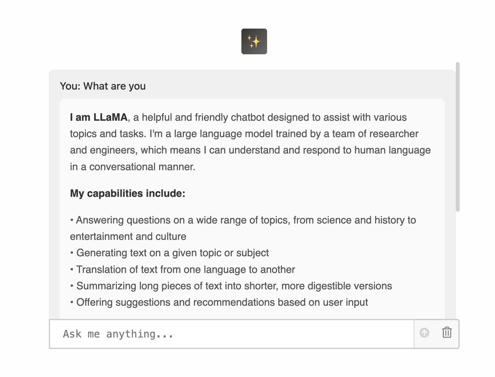

# AI Chatbot

A modern React-based AI chatbot application powered by Groq's fast inference API. Built with TypeScript and Vite for optimal performance and developer experience.

  <div align="center" style="display: flex; justify-content: center; gap: 20px; flex-wrap: wrap;">
  <div style="flex: 1; max-width: 400px;">
    
  </div>
  <div style="flex: 1; max-width: 400px border:2px solid;">
    
   
  </div>
</div>

## Features

- 🤖 AI-powered conversations using Groq SDK
- ⚡ Lightning-fast responses with Groq's LPU inference
- 🎨 Modern React UI
- 📱 Responsive design for all devices
- 🔧 TypeScript for type safety
- ⚡ Vite for fast development and building

## Tech Stack

- **Frontend**: React 19.1.0 with TypeScript
- **AI Provider**: Groq SDK for fast LLM inference
- **Icons**: React Icons for beautiful UI elements
- **Build Tool**: Vite for fast development

## Prerequisites

Before running this project, make sure you have:

- Node.js (version 16 or higher)
- npm or yarn package manager
- A Groq API key - create your own [here](https://console.groq.com)

## Installation

1. Clone the repository:

```bash
git clone <your-repo-url>
cd ai-chatbot
```

2. Install dependencies:

```bash
npm install
```

3. Create a `.env` file in the root directory and add your Groq API key:

```env
VITE_GROQ_API_KEY=your_groq_api_key_here
```

## Usage

### Development

Start the development server:

```bash
npm run dev
```

The application will be available at `http://localhost:5173`

### Build

Create a production build:

```bash
npm run build
```

### Preview

Preview the production build:

```bash
npm run preview
```

### Linting

Run ESLint to check code quality:

```bash
npm run lint
```

## Groq Integration

This chatbot uses Groq's SDK for fast AI inference. Groq provides:

- Ultra-fast response times with LPU technology
- Support for popular open-source models
- Simple REST API integration
- Cost-effective AI inference

## License

This project is licensed under the MIT License - see the [LICENSE](LICENSE) file for details.

## Connect with me

[LinkedIn](https://www.linkedin.com/in/deepprajapati) -
[Github](https://github.com/dprajapati4/)
